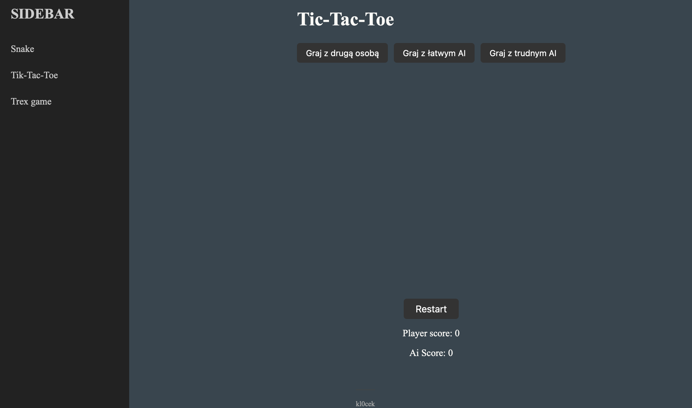

# WebGames Project

A collection of classic browser-based games built with pure JavaScript, HTML, and CSS. This project includes three games: Snake, Tic-Tac-Toe, and T-Rex Runner, complete with unit testing.



## Overview

This project demonstrates front-end web development skills using vanilla JavaScript ES6+, without any frameworks. It features a modular architecture, comprehensive testing suite.

**Key Features:**
- Comprehensive unit testing with Jest
- Local storage integration for persistent high scores
- Responsive sidebar navigation system
- Three fully functional games with scoring systems

## Games Included

### Snake Game
The classic Snake game where you control a snake to eat food and grow longer.
- **Controls:** WSAD for movement
- **Features:** Two difficulty levels (Easy/Hard), collision detection, score tracking
- **Goal:** Eat food to grow while avoiding walls and your own tail

### Tic-Tac-Toe
Strategic game against an AI opponent.
- **Controls:** Mouse clicks on grid cells
- **Features:** Player vs AI, win/draw detection, score tracking
- **Goal:** Get three symbols in a row before the AI does

### T-Rex Runner
Endless runner inspired by web offline game.
- **Controls:** Spacebar to jump
- **Features:** Obstacle generation, collision detection, increasing difficulty
- **Goal:** Jump over obstacles and survive as long as possible

## Technologies Used

- **Frontend:** HTML5, CSS3, JavaScript ES6+
- **Testing:** Jest, jsdom, Babel
- **Storage:** Local Storage API
- **Build Tools:** npm, Babel for ES6+ transpilation

## Project Structure

```
webgames/
│
├── src/                    # Source files
│   ├── script.js           # Main application entry point
│   ├── sidebar.js          # Navigation and UI logic
│   ├── snakeGame.js        # Snake game implementation
│   ├── TikTacToeGame.js    # Tic-Tac-Toe game logic
│   ├── Trex.js             # T-Rex runner game
│   ├── setupTests.js       # Test configuration and mocks
│   └── logic/
│       ├── snakeLogic.js   # snake logic
│       └── TikTacToeLogic.js # TicTacToe logic
│
├── tests/                  # Unit tests
│   ├── sidebar.test.js     # Navigation tests
│   ├── snakeGame.test.js   # Snake game tests
│   ├── TikTacToeGame.test.js # Tic-Tac-Toe tests
│   └── Trex.test.js        # T-Rex game tests
│
├── styles/                 # Stylesheets
│   ├── style.css           # Main styles and Snake game
│   ├── styleTikTacToe.css  # Tic-Tac-Toe specific styles
│   └── styleTrex.css       # T-Rex game specific styles
│
├── favicon_io/             # Favicon files
│   ├── apple-touch-icon.png
│   ├── favicon-32x32.png
│   └── favicon-16x16.png
│
├── index.html              # Main HTML file
├── package.json            # npm configuration and dependencies
├── jest.config.js          # Jest testing configuration
├── .babelrc               # Babel transpilation settings
└── README.md              # Project documentation
```

## Installation & Setup

### Prerequisites
- Node.js (v14 or higher)
- npm (comes with Node.js)

### Development Setup

1. **Clone the repository:**
   ```bash
   git clone https://github.com/kl0cek/SimpleWebApp.git
   cd SimpleWebApp
   ```

2. **Install dependencies:**
   ```bash
   npm install
   ```

3. **Run the application:**
   - Open `index.html` in your browser, or
   - Use a local development server like Live Server in VS Code

### Running Tests

```bash
# Run all tests once
npm test

# Run tests in watch mode (auto-rerun on changes)
npm run test:watch

# Generate coverage report
npm run test:coverage

# Run tests with detailed output
npm run test:verbose
```

## How to Play

### Navigation
1. Use the **SIDEBAR** to select a game
2. Click on any game name to start playing
3. Click **SIDEBAR** again to return to the main menu

### Game Controls

**Snake:**
- Use (wsad) to control the snake
- Eat red food squares to grow and increase score
- Avoid htiing your body
- On Hard avoid hitting walls too

**Tic-Tac-Toe:**
- Click on any empty cell to place your X
- The AI will automatically place an O
- First to get three in a row wins

**T-Rex Runner:**
- Press **Spacebar** to make the dinosaur jump
- Time your jumps to avoid incoming obstacles
- Score increases based on survival time

## License

[MIT License](LICENSE)
## Author

**kl0cek** - [GitHub Profile](https://github.com/kl0cek)